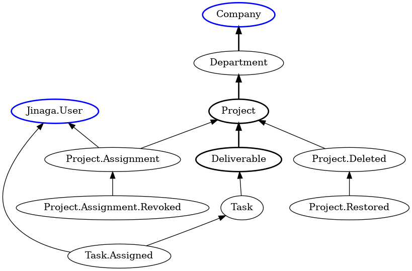
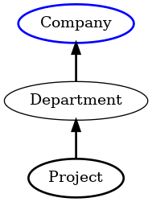

There are two ways to generate SQL from a Jinaga specification.
One is used to populate feeds.
The other is used to project current state.
The goals are different enough to warrant separate code paths.

In this walkthrough, we will be using a complex specification that demonstrates all of the features of the language:

```
(company: Company, user: Jinaga.User) {
    project: Project [
        project->department: Department->company: Company = company
        !E {
            deleted: Project.Deleted [
                deleted->project: Project = project
                !E {
                    restored: Project.Restored [
                        restored->deleted: Project.Deleted = deleted
                    ]
                }
            ]
        }
        E {
            assignment: Project.Assignment [
                assignment->project: Project = project
                assignment->user: Jinaga.User = user
                !E {
                    revoked: Project.Assignment.Revoked [
                        revoked->assignment: Project.Assignment = assignment
                    ]
                }
            ]
        }
    ]
    deliverable: Deliverable [
        deliverable->project: Project = project
    ]
} => {
    assignedTasks = {
        task: Task [
            task->deliverable: Deliverable = deliverable
            E {
                assignment: Task.Assignment [
                    assignment->task: Task = task
                    assignment->user: Jinaga.User = user
                ]
            }
        ]
    } => {
        number = task.number
    }
}
```

The model for this specification looks like this:



The blue facts are givens.
The thick black facts are the top-level unknowns.

## Projecting Current State

Jinaga projects current state when executing `j.query` or `j.watch`.
When `j.query` is called, it first fetches feeds from the remote replicator.
Then it projects the current state from the local database.
When `j.watch` is called, it does the same two operations in the opposite order.
It projects the current state first, and then modifies current state as it fetches from the replicator.

In either case, the current state is not concerned with the entire history.
It only accounts for facts that match the specification at the moment of execution.

The operation begins in [`postgres-store`](../../src/postgres/postgres-store.ts), `read`.
It first loads all of the fact type IDs and role IDs represented in the specification.
Not all of them might be present in the database.
Perhaps the specification includes types of facts that have never been created locally.
As we'll see later, missing fact type IDs and role IDs make a portion of the SQL query unsatisfiable.

The operation is then broken into three steps.
First it produces a tree of `ResultComposer`s, each of which has a SQL query and a mechanism for composing the projection objects.
Then it executes the SQL in the tree, producing a `ResultSetTree`.
Finally, the `ResultComposer`s compose that tree into an array of projections.

### Generate SQL for a ResultComposer

The tree of `ResultComposer` objects mirrors the tree of specifications inside of projections.
The top-most specification has a projection with named elements.
If that element is a child specification, then it gets it's own child `ResultComposer`.
The composers match their results to their parent based on a list of fact IDs.

The tree is constructed in [`specification-result-sql`](../../src/postgres/specification-result-sql.ts), starting in the `resultSqlFromSpecification` function.
It uses `ResultDescriptionBuilder.buildDescription` to walk the specification.

It first creates an empty `QueryDescription`.
This is an immutable data structure.
As the builder visits parts of the specification, it will operate on the query description to create new, more complete query descriptions.

Next, the result description builder adds edges to the result description.
It calls `addEdges`, which walks the matches and conditions.
Conditions are either path conditions or existential conditions

#### Path conditions

A path condition connects an unknown on the left to a previously defined label on the right.
For each path condition, the builder calls `addPathCondition`.
The function first evaluates the label on the right.
If this represents a given that has not yet been added, it adds the input now.

In this example, the first path connects the unknown `project` to the given `company`.
It makes up just this part of the model:



The lavel `company` refers to a given that has not yet been added.
It therefore allocates the fact, input, and parameter, producing the following `QueryDescription`:

```json
{
  "inputs": [
    {
      "label": "company",
      "factIndex": 1,
      "factTypeParameter": 1,
      "factHashParameter": 2
    }
  ],
  "parameters": [
    1,
    "fSS1hK7OGAeSX4ocN3acuFF87jvzCdPN3vLFUtcej0lOAsVV859UIYZLRcHUoMbyd/J31TdVn5QuE7094oqUPg=="
  ],
  "outputs": [],
  "facts": [
    {
      "factIndex": 1,
      "type": "Company"
    }
  ],
  "edges": [],
  "existentialConditions": []
}
```

It then identifies the type and index of the right-hand label.
In this case, the type is "Company" and the index is 1.
Then, it walks up the predecessor roles on the right, adding edges as it goes.
In this case, there are no roles, so it adds no edges on this pass.

After walking up the right-hand side, the builder starts from the unknown and walks up the left-hand-side.
It records this walk so that it can reverse it to add edges.
The joins need to continue from where the right and left sides meet, and proceed backward toward the unknown.

In this case, the left-hand-side of the path condition is `project->department: Department->company: Company`.
The edges produced are:

```json
[
  {
    "roleId": 1,
    "declaringType": "Project"
  },
  {
    "roleId": 2,
    "declaringType": "Department"
  }
]
```

It reverses that array of edges, then adds them to the query description.
For each one, it allocates a parameter for the role ID.
Then it allocates a new fact index if necessary, and then a new edge.

When it has finished with the edges, it adds the unknown as an output.
At this point, the example query description looks like this:

```json
{
  "inputs": [
    {
      "label": "company",
      "factIndex": 1,
      "factTypeParameter": 1,
      "factHashParameter": 2
    }
  ],
  "parameters": [
    1,
    "fSS1hK7OGAeSX4ocN3acuFF87jvzCdPN3vLFUtcej0lOAsVV859UIYZLRcHUoMbyd/J31TdVn5QuE7094oqUPg==",
    2,
    1
  ],
  "outputs": [
    {
      "label": "project",
      "type": "Project",
      "factIndex": 3
    }
  ],
  "facts": [
    {
      "factIndex": 1,
      "type": "Company"
    },
    {
      "factIndex": 2,
      "type": "Department"
    },
    {
      "factIndex": 3,
      "type": "Project"
    }
  ],
  "edges": [
    {
      "edgeIndex": 1,
      "predecessorFactIndex": 1,
      "successorFactIndex": 2,
      "roleParameter": 3
    },
    {
      "edgeIndex": 2,
      "predecessorFactIndex": 2,
      "successorFactIndex": 3,
      "roleParameter": 4
    }
  ],
  "existentialConditions": []
}
```

This corresponds to the following SQL:

```sql
SELECT f3.hash AS hash3, f3.fact_id AS id3, f3.data AS data3
  FROM public.fact f1  -- company
  JOIN public.edge e1  -- department->company
    ON e1.predecessor_fact_id = f1.fact_id
  AND e1.role_id = $3
  JOIN public.fact f2  -- department
    ON f2.fact_id = e1.successor_fact_id
  JOIN public.edge e2  -- project->department
    ON e2.predecessor_fact_id = f2.fact_id
  AND e2.role_id = $4
  JOIN public.fact f3  -- project
    ON f3.fact_id = e2.successor_fact_id
WHERE f1.fact_type_id = $1
  AND f1.hash = $2
ORDER BY f3.fact_id ASC
```

#### Existential conditions

When the builder encounters an existential condition, it produces a WHERE NOT EXISTS clause.
It recursively constructs a query description for that sub select.

The way that it builds the existential condition is a little interesting.
It adds the existential condition to the query description, and then records the path to the one that it is working on.
This first existential condition is at index 0 of the top-level query description, so it is at path `[ 0 ]`.
When we get to the existential condition *inside* of this one, it will have path `[ 0, 0 ]`.

The reason for building the query definitions this way is that the parameters and facts all exist only at the top level.
We need one consistent set of indexes so that every alias in the SQL query is distinct.
We also need one consistent set of parameters to pass to the query.

By the time the builder has finished adding the edges for the existential condition, the query definition looks like this:

```json
{
  "inputs": [
    {
      "label": "company",
      "factIndex": 1,
      "factTypeParameter": 1,
      "factHashParameter": 2
    }
  ],
  "parameters": [
    1,
    "fSS1hK7OGAeSX4ocN3acuFF87jvzCdPN3vLFUtcej0lOAsVV859UIYZLRcHUoMbyd/J31TdVn5QuE7094oqUPg==",
    2,
    1,
    3,
    4
  ],
  "outputs": [
    {
      "label": "project",
      "type": "Project",
      "factIndex": 3
    }
  ],
  "facts": [
    {
      "factIndex": 1,
      "type": "Company"
    },
    {
      "factIndex": 2,
      "type": "Department"
    },
    {
      "factIndex": 3,
      "type": "Project"
    },
    {
      "factIndex": 4,
      "type": "Project.Deleted"
    },
    {
      "factIndex": 5,
      "type": "Project.Restored"
    }
  ],
  "edges": [
    {
      "edgeIndex": 1,
      "predecessorFactIndex": 1,
      "successorFactIndex": 2,
      "roleParameter": 3
    },
    {
      "edgeIndex": 2,
      "predecessorFactIndex": 2,
      "successorFactIndex": 3,
      "roleParameter": 4
    }
  ],
  "existentialConditions": [
    {
      "exists": false,
      "inputs": [],
      "edges": [
        {
          "edgeIndex": 3,
          "predecessorFactIndex": 3,
          "successorFactIndex": 4,
          "roleParameter": 5
        }
      ],
      "existentialConditions": [
        {
          "exists": false,
          "inputs": [],
          "edges": [
            {
              "edgeIndex": 4,
              "predecessorFactIndex": 4,
              "successorFactIndex": 5,
              "roleParameter": 6
            }
          ],
          "existentialConditions": []
        }
      ]
    }
  ]
}
```

This corresponds to the following SQL:

```sql
SELECT f3.hash AS hash3, f3.fact_id AS id3, f3.data AS data3
  FROM public.fact f1  -- company
  JOIN public.edge e1  -- department->company
    ON e1.predecessor_fact_id = f1.fact_id
  AND e1.role_id = $3
  JOIN public.fact f2  -- department
    ON f2.fact_id = e1.successor_fact_id
  JOIN public.edge e2  -- project->department
    ON e2.predecessor_fact_id = f2.fact_id
  AND e2.role_id = $4
  JOIN public.fact f3  -- project
    ON f3.fact_id = e2.successor_fact_id
WHERE f1.fact_type_id = $1
  AND f1.hash = $2
  AND NOT EXISTS (
    SELECT 1
    FROM public.edge e3  -- deleted->project
    JOIN public.fact f4  -- deleted
      ON f4.fact_id = e3.successor_fact_id
    WHERE e3.predecessor_fact_id = f3.fact_id
      AND e3.role_id = $5
      AND NOT EXISTS (
        SELECT 1
        FROM public.edge e4  -- restored->deleted
        JOIN public.fact f5  -- restored
          ON f5.fact_id = e4.successor_fact_id
        WHERE e4.predecessor_fact_id = f4.fact_id
          AND e4.role_id = $6
      )
  )
ORDER BY f3.fact_id ASC
```

### Compose projection